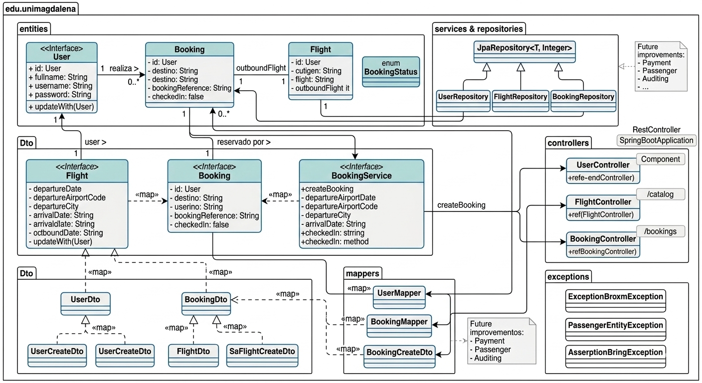

# TrabajoFinalWeb
Sistema de Gestión de Reservas de Vuelos
# ✈️ Sistema de Gestión de Reservas de Vuelos - Backend API
Un sistema backend desarrollado con Spring Boot para gestionar reservas de vuelos, usuarios y estados de reservación.

# 🛠️ Tecnologías Utilizadas
- Java 21 - Lenguaje principal
- Spring Boot 3.3.10 - Framework backend
- Spring Data JPA - Acceso a datos
- Lombok - Reducción de código boilerplate
- SQL Server - Base de datos de producción
- Maven - Gestión de dependencias
- Swagger (OpenAPI 3.0)

# 🚀 Configuración del Proyecto
Requisitos Previos
-JDK 21
-Maven 3.6+
-Opcional: SQL Server (para entorno de producción)

# 📂 Estructura del Proyecto 
TrabajoFinalWeb (Multi-Módulo Maven)
├── backend (Módulo principal)
│   ├───docs
│   │   ├── API.md                 # Detalle técnico de endpoints
│   │   └── ENTITIES.md            # Descripción profunda de entidades
│   │   
│   │ 
│   ├── src/main/java/edu/unimagdalena
│   │   ├── controllers      # Controladores REST
│   │   ├── Dto              # Objetos de Transferencia de Datos
│   │   ├── entities         # Entidades JPA
│   │   ├── exceptions       # Manejo de excepciones
│   │   ├── repositories     # Repositorios Spring Data JPA
│   │   └── services         # Lógica de negocio
│   └── BackendWebApplication.java # Punto de entrada
├── README.md
│
└── frontend (Módulo principal) # proximo

## 📊 Swagger UI
Accede a la documentación interactiva:  
🔗 [http://localhost:8080/swagger-ui.html](http://localhost:8080/swagger-ui.html)

## 🚀 Cómo Ejecutar
```bash
mvn spring-boot:run
```
## Diagrama del proyecto


